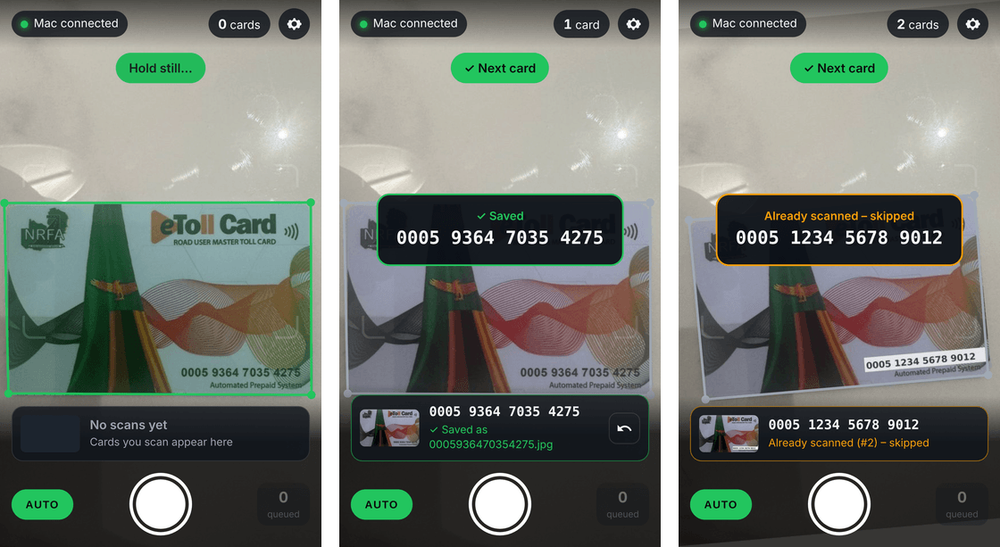
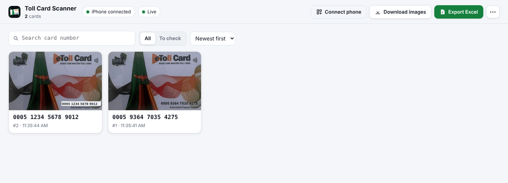
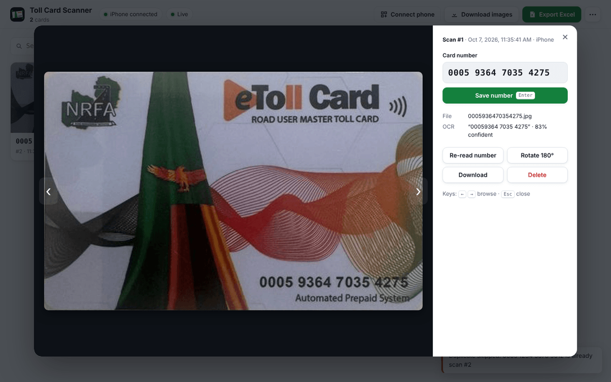
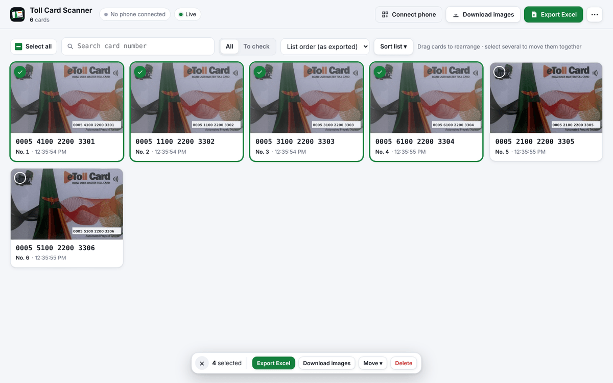

# Toll Card Scanner

Scan eToll cards with your **iPhone** and watch them arrive on your **MacBook**:

- the phone finds the card's edges by itself and captures automatically once the card is steady,
- every card is **cropped and straightened** (perspective/skew correction) into a flat 1600 × 1009 image,
- the 16‑digit card number is read (OCR) and the image is saved as **`<card number>.jpg`**,
  e.g. `0005 1234 5678 9012` → `0005123456789012.jpg`,
- the portal on the Mac updates live, so you can preview, correct, **download all images (ZIP)** and **export Excel** with the card numbers.

Built for long runs of about 400 cards: duplicates are skipped, unreadable cards are flagged, nothing is lost if the Wi‑Fi drops, and everything stays on your Mac.

| iPhone scanner | Mac portal |
| --- | --- |
|  |   |

---

## 1. Start it on the Mac (once per session)

You need [Node.js](https://nodejs.org) **22 LTS** (or 20.9+) installed on the Mac.

1. Download this project (green **Code** button → *Download ZIP*, then unzip; or `git clone`).
2. Double‑click **`start.command`**.
   - First time macOS may refuse: right‑click the file → **Open** → **Open**.
   - If it says it has no permission (common after a ZIP download), open Terminal in the folder and run `chmod +x start.command` once.
   - Or from Terminal: `npm install` then `npm start`.
3. The first start installs the components (needs internet once). Then the portal opens at **http://localhost:8080**.
4. If macOS asks *“Do you want the application node to accept incoming network connections?”* click **Allow**. The iPhone can't connect otherwise.

Keep the Terminal window open while you scan. **Ctrl + C** stops the scanner.

## 2. Connect the iPhone (first time takes ~1 minute)

1. Put the iPhone on the **same Wi‑Fi** as the Mac.
2. In the portal click **Connect phone** and scan the QR code with the iPhone **Camera** app.
3. First time only, the phone shows a short setup to trust the Mac's certificate (iOS only allows the camera on secure connections):
   1. **Download certificate** → *Allow* → *Close*
   2. **Settings** → *Profile Downloaded* → **Install**
   3. **Settings → General → About → Certificate Trust Settings** → switch on **Toll Card Scanner Local CA**
   4. Go back to Safari; it continues by itself.
4. Tap **Start scanning** and allow the camera.
5. Optional but recommended: **Share → Add to Home Screen** to install it as an app (“Card Scan”).

From then on the phone connects automatically whenever the scanner is running on the Mac.

## 3. Scan

- Lay the card on a **dark, plain surface** (a black mouse mat, folder or cloth). White cards on white tables work too, but a dark background is fastest and most reliable.
- Hold the phone so the card fills most of the frame and avoid glare on the number.
- The outline turns **green**, then *“Hold still…”*, then the card is captured with a flash and beep.
- When the hint says **“✓ Next card”**, swap the card. The next capture starts once the old card has left the view.
- After each capture the phone shows the number it read:
  - **✓ Saved** (green): done.
  - **Saved – check number** / **Number not readable** (amber): fix it later on the Mac (see below).
  - **Already scanned – skipped** (amber): that card number is already in the list.
- The **↶** button on the last result removes that scan (e.g. you captured the wrong card).
- **AUTO** toggles auto‑capture. With it off, tap the big round button to capture.
- If Wi‑Fi drops or the Mac is busy, captures queue on the phone (*queued* counter) and upload automatically.

## 4. Review, download and export on the Mac

- New cards appear at the top of the portal instantly.
- **To check** filter: scans whose number could not be read or that should be double‑checked. Click a card (or its number), type the 16 digits, press **Enter**. The file is renamed to the new number and the next card to check opens automatically.
- In the preview you can also **Re‑read number**, **Rotate 180°**, **Download** or **Delete** a scan. Use ← → to browse.
- **Download images** → a ZIP with all `<card number>.jpg` files.
- **Export Excel** → `toll-cards-<date>.xlsx` with columns *No.*, *Card Number*, *Image File*, *Scanned At*, in list order. Card numbers are stored as text, so the leading zeros and all 16 digits stay intact.
- The images are also saved directly in the project folder under `data/images/`.
- **⋯ → Archive batch & start new** moves the current batch to `data/archive/<date-time>/` and empties the list (download/export first).

### Select, delete, re‑arrange or export only some cards



- **Select cards:** hover a card and tick the round checkbox in its corner. **Shift‑click** a second card to select everything in between, **⌘A** selects every card shown (respecting search and the *To check* filter), **Esc** clears the selection. While cards are selected, clicking a card adds or removes it.
- The **selection bar** at the bottom then offers:
  - **Export Excel** / **Download images** for just the selected cards,
  - **Move ▾** to the start or end of the list, or to a position number,
  - **Delete** (or press **⌫**). Deleted images go to `data/trash/` on the Mac.
- **List order** is the order of the *No.* column in Excel and in the portal. Choose **List order (as exported)** in the view menu, then **drag cards** to where they belong. Dragging a selected card moves all selected cards together.
- **Sort list ▾** re‑orders the whole list by card number (ascending or descending), by scan time, or reverses it.
- Every re‑order is saved on the Mac straight away. The toast that appears has an **Undo** button for the latest change.
- New scans are always added at the end of the list. *Newest scans first* only changes the view, not the list order.

## Troubleshooting

| Problem | Fix |
| --- | --- |
| iPhone page can't connect | Same Wi‑Fi? Did you click *Allow* for incoming connections? (System Settings → Network → Firewall → Options → allow `node`.) Guest/office Wi‑Fi often blocks devices from talking to each other: turn on the iPhone's **Personal Hotspot** and connect the Mac to it. |
| “This Connection Is Not Private” | Finish the certificate steps in section 2 (both *Install* and *Certificate Trust Settings*). |
| Camera doesn't start | Settings → Apps → Safari → Camera → *Allow*, or in Safari tap **aA → Website Settings → Camera**. |
| Mac changed network / IP address | Restart the scanner and scan the QR code again. The certificate is reissued automatically and stays trusted. |
| Card outline flickers / not found | Use a dark background, avoid strong reflections, and move a little closer. You can always capture manually with the round button; the scan is still cropped if the edges are found. |
| Wrong number read | Fix it in the portal (click the number). Numbers that look doubtful are flagged under **To check**. |
| Port already in use | It picks the next free port automatically, or set `PORT=9090 HTTPS_PORT=9443 npm start`. |

## How it works

```
iPhone (Safari / home-screen app)                         MacBook (node server/index.js)
──────────────────────────────────                        ──────────────────────────────────────
camera ─▶ OpenCV.js in a Web Worker                        HTTPS :8443 (phone)  HTTP :8080 (portal)
          · edge map: contrast-boosted grey + colour       · OCR: locate the 16-digit line, strip the
          · candidates: contours, Otsu, Hough lines          wavy artwork, Tesseract digits-only,
          · score: straight edges on all 4 sides,             cross-check two binarisations, auto-detect
            card proportions, corners that really end         upside-down cards
          · steady for 0.45 s ─▶ capture full-res frame     · save data/images/<number>.jpg + thumbnail
          · perspective warp ─▶ 1600×1009 JPEG ─────────▶   · live updates to the portal (Server-Sent Events)
          · offline queue in IndexedDB                      · Excel (.xlsx) + ZIP export
```

- **Everything runs locally.** No cloud service; after the one‑time install no internet is needed.
- **Pairing:** the QR code contains a random access token (stored in `data/access-token`). Other people on the same Wi‑Fi can't see or change your scans without it; the portal itself only opens on the Mac (`localhost`).
- **Certificate:** `data/certs/` holds a certificate authority created just for this Mac (like the popular `mkcert` tool). Its private key never leaves the Mac. When you no longer use the scanner, remove the profile on the iPhone (Settings → General → VPN & Device Management).

## Development

```bash
npm install
npm test          # detector, OCR and API tests (node:test)
npm start         # DATA_DIR, PORT, HTTPS_PORT can be overridden via environment variables
```

```
server/            Express server: OCR (ocr.js), storage (store.js), certificates, exports
public/scan/       iPhone PWA: scanner.js (UI, capture, upload queue), detector-worker.js,
                   lib/card-detector.js (edge detection + deskew, shared with the tests), sw.js
public/portal/     Mac portal
public/phone.html  phone landing page (certificate check / setup)
test/              tests; fixtures/ holds a sample photo whose card number was edited
                   (0005 9364 7035 4275, not a real card)
```
